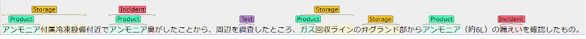
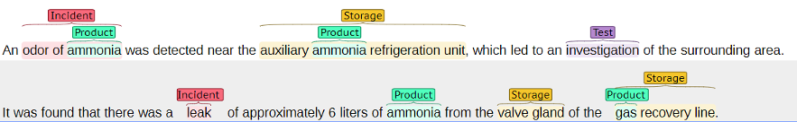
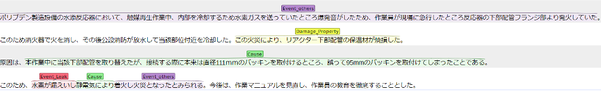
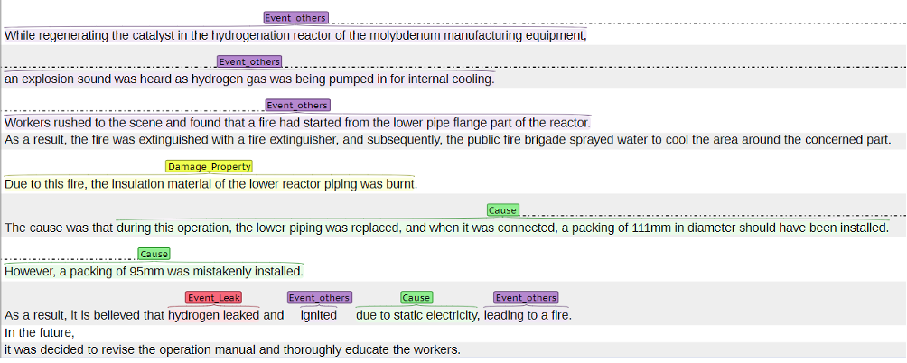
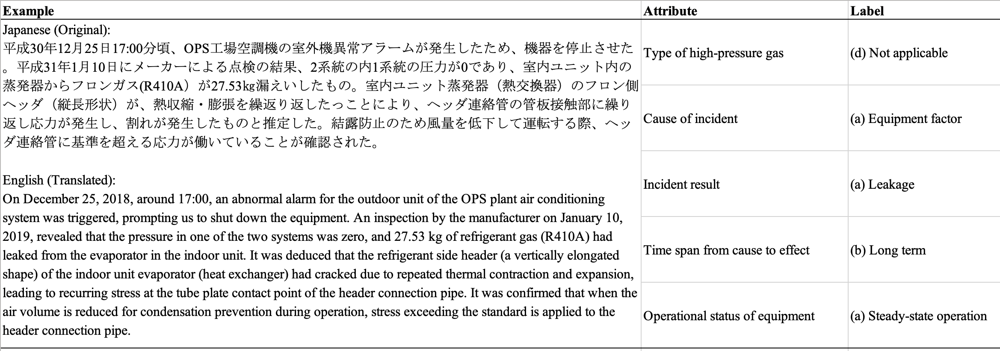

# HPG IncidentAI Dataset

## Overview

This project provides a new Japanese IncidentAI dataset for safety prevention on high-pressure gas plant domain. Our dataset comprises NLP three tasks: **Named Entity Recognition (NER)**, **Cause-Effect Extraction (CE)**, and **Information Retrieval (IR)**.
The original dataset was collected from publicly available [reports of high-gas incidents published in 2022 by the High-Pressure Gas Safety Institute of Japan](https://www.khk.or.jp/public_information/incident_investigation/hpg_incident/incident_db.html).

The dataset is annotated by domain experts who have at least six years of practical experience as high-pressure gas conservation managers. These experts possess qualifications as high-pressure gas production safety managers, a national certification demonstrating a certain level of knowledge and experience necessary to ensure the safety of high-pressure gas manufacturing facilities.

The detailed descriptions of each annotation definition for NER, CE and IR can be accessed in our annotation guideline, `HPG_Annotaion_Guideline.pdf`.

## Named Entity Recognition

### Definitions
The NER dataset include six type of entities as following.
| Entity    | Descriptions                                                                                                                                                                                                                                                                                                                   | Examples                                                                                                                                                                                                                          |
| --------- | ------------------------------------------------------------------------------------------------------------------------------------------------------------------------------------------------------------------------------------------------------------------------------------------------------------------------------ | --------------------------------------------------------------------------------------------------------------------------------------------------------------------------------------------------------------------------------- |
| Products  | Various gases. Gaseous state at normal temperature and pressure. Nouns.  ※Do not tag items that are not general (things that do not appear even if you search the Web).                                                                                                                                        | Mixed gas Flammable gas Refrigerant gas Inert gas Liquefied petroleum gas Carbon dioxide gas Sulphur dioxide gas Liquefied petroleum gas Freon Hydrogen, Carbon monoxide, Acetylene, Methane, Ethylene |
| Chemicals | Chemical substances, reactants, and materials (other than gases) used in gas generation and process management。 Items not included in the above Products. Nouns.                                                                                                                                                        | Water, water droplets, rainwater, wash water, hot water, pure water H2O Benzene Austenitic stainless steel Lubricating oil C4-C6 Hydrocarbons                                                                   |
| Storages  | General equipment where above Products and Chemicals come into contact.  ※Include equipment such as supports and insulators. ※Include expressions that indicate the entire plant or facility. ※Do not include expressions indicating parts such as entrances and exits if they are placed at the end of a word. | Tank Maturation furnace Refining tower Dehumidification tower Separation tower Heat exchanger Piping Valve Gasket Flange BTX manufacturing equipment Butadiene plant                             |
| Incidents | Incidents that resulted in or caused an accident, regardless of severity. Include only incidents that actually occurred, and do not include situations that did not lead to an incident.                                                                                                                                       | Explosion Seepage Leakage Fire Serious injury Death Degradation Concentration Issuing of an alert, detection, awareness, (alarm) activation                                                               |
| Process   | Handling of gas, and unit operations related to gas. Abnormal processes are included in Incidents.                                                                                                                                                                                                                          | Filling Distillation Extraction Reaction Recovery Mixing Sealing Nitrogen purge                                                                                                                              |
| Tests     | Inspection devices and inspection actions outside the production process line. Do not include inspection items such as XX concentration.                                                                                                                                                                                    | Inspection, visual inspection, three-month inspection Detailed inspection, leakage inspection Freon checker Leak test Analysis Patrol                                                                              |

### Example Data
#### Japanese (Original)

#### English (Translated)

## Cause-Effect Extraction
### Definitions
The CE dataset define the span following five type of entities.

| Entity          | Descriptions                                                                                                                                                                                                                                                                                                                   | Examples                                                                                                 |
| --------------- | ------------------------------------------------------------------------------------------------------------------------------------------------------------------------------------------------------------------------------------------------------------------------------------------------------------------------------ | -------------------------------------------------------------------------------------------------------- |
| Event_Leak      | Various gases. Gaseous state at normal temperature and pressure. Nouns.  ※Do not tag items that are not general (things that do not appear even if you search the Web).                                                                                                                                        | Hydrogen and aniline leakage                                                                             |
| Event_others    | Chemical substances, reactants, and materials (other than gases) used in gas generation and process management。 Items not included in the above Products. Nouns.                                                                                                                                                        | It is estimated that hydrogen, which has a low ignition energy, was ignited by static electricity. |
| Damage_Property | General equipment where above Products and Chemicals come into contact.  ※Include equipment such as supports and insulators. ※Include expressions that indicate the entire plant or facility. ※Do not include expressions indicating parts such as entrances and exits if they are placed at the end of a word. | Container ruptures.                                                                                      |
| Damage_Human    | Incidents that resulted in or caused an accident, regardless of severity. Include only incidents that actually occurred, and do not include situations that did not lead to an incident.                                                                                                                                       | One employee injured left thigh and left ear.                                                         |
| Cause           | Tag sentences that confirm the event causing Event_Leak and Event_others. Target not only direct causes but also indirect causes (e.g., Cause's Cause)。 In case of ignition or explosion, the three elements of combustion (combustibles, oxygen, and heat) shall be noted cause.                     | As a result of reduced tightening torque in some of the flange sections cooled by hydrogen         |

### Example Data
#### Japanese (Original)

#### English (Translated)

## Information Retrieval
### Definitions
The IR dataset defines `Attributes` and their `Labels` for a given accident descriptions as following table.

| Attribute                                                                | Label                                                                                                                                                                                                | Description                                                                                                                                                                                                                                                                                                                                                                                                                                                                                                       |
| ------------------------------------------------------------------------ | ---------------------------------------------------------------------------------------------------------------------------------------------------------------------------------------------------- | ----------------------------------------------------------------------------------------------------------------------------------------------------------------------------------------------------------------------------------------------------------------------------------------------------------------------------------------------------------------------------------------------------------------------------------------------------------------------------------------------------------------- |
| Types of high-pressure gas                                            | a. Flammable (or flame retardant) gas b. Toxic gas c. Satisfies a and b d. Not applicable                                                                                                | The high-pressure gas that caused the reported accident was classified from the perspective of danger in the event of an accident. Cases where the gas could not be identified were included under “d. Not applicable”. The definition of flammable gas and toxic gas shall conform to the High Pressure Gas Safety Act in Japan.                                                                                                                                                       |
| Cause of accident                                                        | a. Equipment Factor b. Human Factor c. External factor d. Other factor                                                                                                                      | The events that caused or triggered the accident were classified. Equipment factors refer to those caused by initial defects in parts built into the equipment. Human factors refer to errors made in operation or judgment by people on site. External factors indicate those caused by events from outside the equipment, such as falling objects.                                                                                                                                            |
| Accident Results                                                         | a. Leakage b. Fires and explosions c. a. and property damage d. a. and human casualties e. b and property damage f. b and human casualties g. Property damage and human casualties | The events that occurred as a result of the accident were classified. Physical and human damage were only considered if they occurred as secondary events, such as gas leaks or fires. Property damage ： Accidents resulting in damage to equipment or facilities due to fire or explosion ※Do not include damage to equipment or other items that caused the accident. Human casualties ： Accidents resulting in health hazards to humans due to leakage, fire, or explosion |
| Time span from cause to effect                                        | a. Sudden b. Long-term c. Unknown                                                                                                                                                              | The classification was made based on the time from when the cause or trigger of the accident occurred until the accident event took place. Sudden ： Accidents where the results are caused generally within a few minutes to several tens of minutes from the occurrence of the cause.                                                                                                                                                                                                         |
| Operational status of equipment at the time of cause occurrence | a, During steady-state operation b. During non-steady state operation c. During maintenance d. Other situations.                                                                            | The classification was made based on the operational status of the equipment at the time of the accident. Non-steady state operation refers to operating conditions that differ from normal operation, such as immediately after the equipment starts running or during test operation.                                                                                                                                                                                                      |

### Example Data

